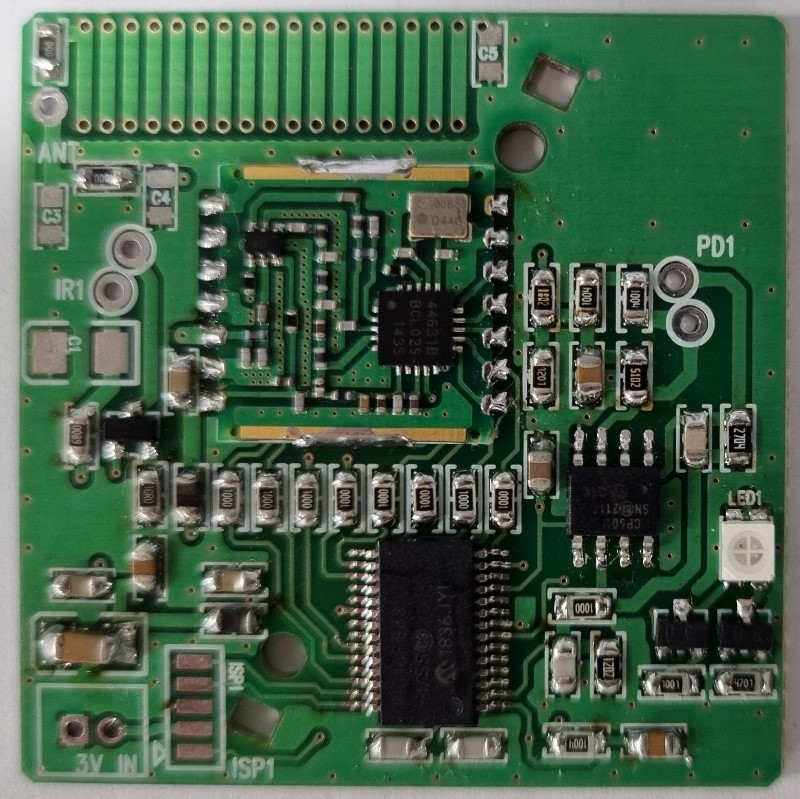

# Wireless RF Module
PIC16F883과 Si4463을 사용하여, 무선송수신 기능을 구현하였습니다.

## 개발환경

프로젝트에 사용된 환경입니다.
- 디바이스 : PIC16F883
- 개발환경 : MPLAB x IDE v6.05
- 컴파일러 : XC8 Compiler v2.41
- 프로그래머 : PICKIT 3
- 사용언어 : C
- 사용기능 : UART, SPI, GPIO


## 기능 설명

Si4463은 142~1050MHz의 주파수 범위에서 작동하는 고집적 무선 송수신 칩으로 안정적이고 효율적인 무선 통신을 제공합니다. FSK(Frequency Shift Keying), GFSK(Gaussian Frequency Shift Keying) 등 다양한 변조 방식을 지원하여 유연한 데이터 전송이 가능합니다.<br>
PIC16F883은 무선 통신 시스템의 컨트롤러 역할을 하는 마이크로컨트롤러 유닛(MCU)입니다. 데이터 흐름 관리, Si4463 트랜시버 구성, 전송 및 수신 프로세스 처리를 담당합니다.<br>
Si4463 트랜시버를 PIC16F883 MCU와 결합하여 완벽한 무선 통신 시스템을 만들었습니다. 이 시스템은 한 장치에서 다른 장치로 무선으로 데이터를 전송하고 지정된 주파수 범위 내에서 다른 장치로부터 데이터를 수신할 수 있습니다.<br>

사양 시트 설명에 포함할 수 있는 몇 가지 주요 기능은 다음과 같습니다.
1. 주파수 범위: Si4463과 PIC16F883의 조합은 142~1050MHz의 주파수 범위에서 무선 통신을 가능하게 하여 광범위한 애플리케이션을 허용합니다.<br>
2. 변조 방식: 시스템은 FSK 및 GFSK와 같은 변조 방식을 지원하여 효율적이고 안정적인 데이터 전송을 가능하게 합니다.<br>
3. 트랜시버 통합: Si4463은 무선 통신 시스템의 설계 및 구현을 단순화하는 고집적 트랜시버 칩입니다.<br>
4. 마이크로컨트롤러 제어: PIC16F883 MCU는 무선 통신 시스템에 대한 제어 및 조정을 제공하여 트랜시버의 데이터 흐름 관리 및 구성을 용이하게 합니다.<br>
5. 안정적인 데이터 전송: 결합된 시스템은 데이터의 안정적인 전송 및 수신을 보장하여 장치 간의 효과적인 무선 통신을 가능하게 합니다.<br>
6. 다양한 애플리케이션: 무선 송수신 기능은 원격 제어 시스템, 센서 네트워크 및 무선 데이터 전송과 같은 다양한 애플리케이션의 가능성을 열어줍니다.<br>

Si4463의 송수신 최대 거리는 다양한 요인에 의해 영향을 받으며, 주파수, 전송 출력, 안테나 품질, 환경 조건 등에 따라 달라집니다.<br>
Si4463는 기본적으로 최대 1km까지의 송수신 거리를 제공할 수 있습니다.<br>

프로젝트의 무선통신 세부사항 설정은 다음과 같습니다.

**function**|**selection**
:---|:---
Device|Si4463
Rev|C2
Crys_freq(Hz)|30MHz
Crys_tol(ppm)|20ppm
MOD_type|4GFSK
Rsymb(sps)|2400
Fdev(Hz)|1000
RXBW(Hz)|150kHz
RF Freq(MHz)|447.275
fhst|25000Hz


## 채널변경 및 Rx, Tx사용

코드의 간단한 수정으로 `Channel` 및 `Packet`, `PacketLength` , `Tx, Rx`를 변경하여 사용할 수 있습니다.

1. 채널 선택

```yaml
#define ch 1        // channel selection, entering values from 0 to 255 *(channel 256 = channel 0)
```

2. Packet 수정

```yaml
sprintf((char *)customRadioPacket,"rftest@channel:%d",ch);  // Putting Data to Send in Packets
```

3. PacketLength 설정

```yaml
/*! Maximal packet length definition (FIFO size) */ 
#define RADIO_MAX_PACKET_LENGTH     64   //default 64
```

4. Tx or Rx 사용
단방향 통신을 사용할 경우, 간단하게 수정할 수 있습니다.
```yaml
#define RX 0        // Set RX module to 1, TX module to 0
```
Tx와 Rx의 함수는 다음과 같이 사용할 수 있습니다.
```yaml
vRadio_StartTx_Variable_Packet(Radio_ChannelNumber, customRadioPacket, RADIO_MAX_PACKET_LENGTH);    // Send stored packets
```

```yaml
vRadio_StartRX(Radio_ChannelNumber,RADIO_MAX_PACKET_LENGTH);

if(TRUE == gRadio_CheckReceived()) {
            // Processing after received
            // ..
            // ..
        }
```

## 모듈제작




## 송수신 테스트


## 🔐 Commit Convention
**Tag Name**|**Description**
:---|:---
feat|새로운 기능을 추가
fix|버그 수정
design|CSS 등 사용자 UI 디자인 변경
!breaking change|커다란 API 변경의 경우
!hotfix|급하게 치명적인 버그를 고쳐야하는 경우
style|코드 포맷 변경, 세미 콜론 누락, 코드 수정이 없는 경우
refactor|프로덕션 코드 리팩토링
comment|필요한 주석 추가 및 변경
docs|문서 수정
test|테스트 코드, 리펙토링 테스트 코드 추가, Production Code(실제로 사용하는 코드) 변경 없음
chore|빌드 업무 수정, 패키지 매니저 수정, 패키지 관리자 구성 등 업데이트, Production Code 변경 없음
rename|파일 혹은 폴더명을 수정하거나 옮기는 작업만인 경우
remove|파일을 삭제하는 작업만 수행한 경우

<br/>

## License
(C) 2023 PETABREW. Author : sehwan.park. Version : Ver 0.1
